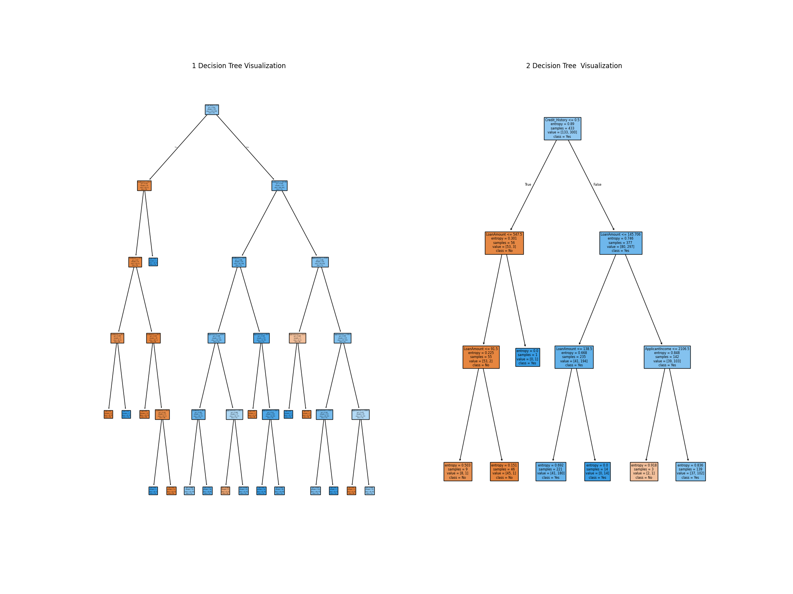

# 🏦 Loan Approval Prediction using Decision Tree (ML Project)

---

## 📌 Project Overview

This project builds a **Decision Tree Machine Learning model** to predict whether a loan application will be approved or not.

It includes:

* Data preprocessing
* Handling missing values
* Model training
* Hyperparameter tuning (GridSearchCV)
* Model evaluation
* Decision Tree visualization

---

## 🎯 Problem Statement

Banks need to decide whether to approve a loan based on applicant details.

This project solves:

> Predicting loan approval (**Yes / No**) using applicant data.

---

## 📊 Dataset

Dataset contains features like:

* ApplicantIncome
* LoanAmount
* Credit_History
* Loan_Status (Target Variable)

---

## ⚙️ Project Workflow

---

### 1️⃣ Data Cleaning

* Filled missing values:

  * LoanAmount → mean
  * Credit_History → 1
* Dropped remaining null values

---

### 2️⃣ Feature Engineering

Converted target variable:

```python
df['Loan_Status'] = df['Loan_Status'].map({'Y':1, 'N':0})
```

Selected features:

* ApplicantIncome
* LoanAmount
* Credit_History

---

### 3️⃣ Train-Test Split

```python
train_test_split(test_size=0.2, random_state=42)
```

* 80% Training
* 20% Testing

---

### 4️⃣ Model Training

Initial model:

```python
DecisionTreeClassifier(max_depth=5, criterion='gini')
```

---

### 5️⃣ Hyperparameter Tuning

Used **GridSearchCV**:

```python
param_grid = {
    'max_depth': [3, 5, 7, 10],
    'criterion': ['gini', 'entropy'],
    'min_samples_split': [2, 5, 10]
}
```

* Cross-validation: 5-fold
* Scoring: F1-score

---

### 6️⃣ Model Evaluation

* Accuracy Score on test data
* Comparison between:

  * Base model
  * Tuned model

---

### 7️⃣ Visualization

* Decision Tree plotted using `plot_tree()`
* Comparison between:

  * Default model
  * Best model from GridSearch

---

## 📈 Results

* Initial Model Accuracy: **XX%**
* Tuned Model Accuracy: **XX%**

### Best Parameters:

```python
{'max_depth': X, 'criterion': 'X', 'min_samples_split': X}
```

---

## 📷 Output Visualization

### Decision Tree Comparison



---

## 🛠 Tech Stack

* Python 🐍
* Pandas
* NumPy
* Scikit-learn
* Matplotlib
* Seaborn
---


##  Key Learnings

* Handling missing values in real datasets
* Decision Tree model training
* Hyperparameter tuning using GridSearchCV
* Cross-validation for reliable performance
* Model interpretability using tree visualization

